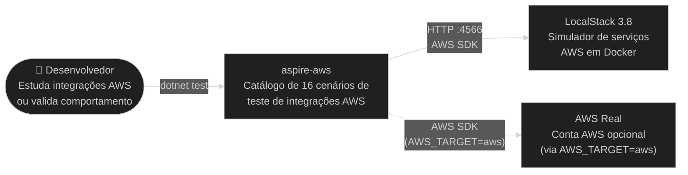

# Arquitetura — aspire-aws

## Visão Geral

**aspire-aws** é um catálogo de 16 cenários progressivos para testar integrações AWS localmente, sem conta AWS. O projeto usa **.NET Aspire 9.5** como orquestrador de containers, **LocalStack 3.8** como simulador dos serviços AWS, e **xUnit** como framework de testes. Lambda handlers são escritos em **Python 3.12**.

Cada cenário é um projeto xUnit independente que sobe e derruba o LocalStack automaticamente via Aspire — sem `docker-compose`, sem scripts externos.

---

## Diagrama de Contexto

---

## Diagrama de Containers

```mermaid
%%{init: {'theme': 'dark'}}%%
graph TD
    dev(["👤 Desenvolvedor"])

    subgraph processo["Processo dotnet test"]
        scenario["Projeto de Cenário\nxUnit (.NET 10)\nexemplo: 01-S3.Basic"]
        shared["Shared Library\n.NET 10 / C#\nFixtures, Factory, Polling"]
        apphost["AppHost\n.NET Aspire 9.5\nConfigura containers"]
    end

    subgraph docker["Docker"]
        localstack["Container LocalStack 3.8\nS3, SQS, SNS, DynamoDB,\nLambda, SSM, Scheduler..."]
        lambdas["Containers Lambda\nPython 3.12 + boto3\n(criados pelo LocalStack)"]
    end

    aws["AWS Real\n(opcional)"]

    dev -->|"dotnet test"| scenario
    scenario -->|"herda / usa"| shared
    shared -->|"DistributedApplicationTestingBuilder"| apphost
    apphost -->|"inicia container"| localstack
    localstack -->|"spawna on demand"| lambdas
    shared -->|"AWS SDK → HTTP :4566"| localstack
    shared -.->|"AWS SDK direto\n(AWS_TARGET=aws)"| aws
```

---

## Mapa de Módulos

| Módulo | Responsabilidade | Documentação |
|--------|-----------------|--------------|
| `src/AppHost/` | Configura e inicia o container LocalStack via Aspire | [README](../../src/AppHost/README.md) |
| `src/Shared/` | Ciclo de vida do LocalStack, factory de clientes AWS, helpers de polling e deploy de Lambdas | [README](../../src/Shared/README.md) |
| `src/lambdas/` | Handlers Python invocados pelo LocalStack nos cenários Lambda | [README](../../src/lambdas/README.md) |
| `scenarios/` | 16 projetos xUnit independentes, um por cenário de integração | — |

---

## Decisões Arquiteturais (ADRs)

| ID | Decisão | Status |
|----|---------|--------|
| [ADR-001](adrs/ADR-001-stack-tecnologica.md) | Tática de stack tecnológica | Proposed |
| [ADR-002](adrs/ADR-002-orquestracao-ambiente-testes.md) | Tática de orquestração do ambiente de testes | Proposed |
| [ADR-003](adrs/ADR-003-simulacao-servicos-aws.md) | Tática de simulação de serviços AWS | Proposed |
| [ADR-004](adrs/ADR-004-isolamento-cenarios-teste.md) | Tática de isolamento entre cenários de teste | Proposed |
| [ADR-005](adrs/ADR-005-assercoes-assincronas.md) | Tática de asserções assíncronas | Proposed |
| [ADR-006](adrs/ADR-006-abstracao-clientes-aws.md) | Tática de abstração de clientes AWS | Proposed |
