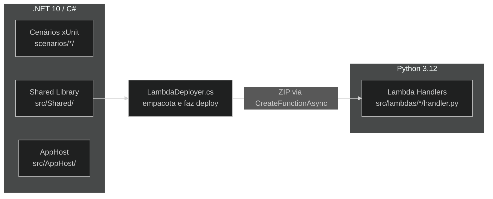

# ADR-001 — Tática de stack tecnológica

**Status:** Proposed  
**Data:** 2026-05-24

---

## Contexto

O projeto precisa cobrir dois domínios técnicos distintos: orquestração de containers, ciclo de vida de testes e integração com AWS SDK (tudo em .NET), e execução de funções serverless no LocalStack (Lambda handlers). A escolha da linguagem para cada domínio afeta a fidelidade dos testes e a facilidade de manutenção.

Evidências no repositório: `global.json` fixa .NET SDK 10.0; `src/lambdas/` contém 9 handlers `.py`; `src/Shared/Shared.csproj` e todos os `*.csproj` de cenários usam `net10.0`.

---

## Opções avaliadas

### Opção A — .NET puro (C# para tudo, incluindo Lambdas)

- Lambda handlers escritos em C# com runtime `dotnet10`
- Um único ecossistema de build
- **Contra:** LocalStack 3.8 Community tem suporte instável para o runtime .NET em ARM64; empacotamento de Lambdas .NET é mais pesado (ZIP com dependências nativas); boto3 não disponível

### Opção B — .NET + Python (escolhida)

- Testes e orquestração em C# (.NET 10)
- Lambda handlers em Python 3.12 + boto3
- **Pró:** Python é o runtime Lambda mais estável no LocalStack; boto3 simplifica a interação com serviços AWS dentro dos handlers; ZIP de deploy é mínimo (um único `handler.py`)
- **Contra:** dois ecossistemas; desenvolvedores precisam conhecer Python 3.12 para alterar handlers

### Opção C — TypeScript (Node.js para tudo)

- Testes em TypeScript (Jest ou Vitest), handlers em Node.js
- **Contra:** abandona o ecossistema .NET / Aspire que é o foco didático do catálogo; AWS SDK for JavaScript é mais verboso para setup de LocalStack

### Opção D — não fazer nada (manter tecnologia ad-hoc sem decisão explícita)

- **Contra:** inconsistência futura; risco de handlers .NET adicionados por contribuidores sem avaliar compatibilidade com LocalStack ARM64

---

## Decisão

**Opção B — .NET 10 / C# para testes e orquestração; Python 3.12 + boto3 para Lambda handlers.**

---

## Justificativa

Python 3.12 é o runtime Lambda mais estável e leve no LocalStack 3.8 Community. O zip de deploy é um único arquivo `handler.py` sem dependências externas além de boto3 (já disponível no ambiente Lambda do LocalStack). C# / .NET 10 é a escolha natural para xUnit e Aspire. A separação de responsabilidades é clara: handlers Python apenas processam eventos e chamam serviços AWS; toda a lógica de setup, assertions e ciclo de vida fica no C#.

### Diagrama



### Fragmento representativo

`src/Shared/LambdaDeployer.cs` — empacotamento e deploy dos handlers Python:

```csharp
// src/Shared/LambdaDeployer.cs (trecho)
// Resolve o caminho do handler Python relativo ao repositório
var handlerDir = Path.Combine(repoRoot, "src", "lambdas", functionName);
var zipPath = Path.GetTempFileName() + ".zip";
ZipFile.CreateFromDirectory(handlerDir, zipPath);

await lambdaClient.CreateFunctionAsync(new CreateFunctionRequest
{
    FunctionName = functionName,
    Runtime = Runtime.Python312,
    Handler = "handler.lambda_handler",
    Code = new FunctionCode { ZipFile = zipStream },
    Role = "arn:aws:iam::000000000000:role/lambda-role"
});
```

---

## Consequências

- Handlers Lambda devem usar apenas a biblioteca padrão Python e `boto3` (disponível no ambiente LocalStack sem instalação adicional)
- Novos handlers seguem o mesmo padrão: um diretório em `src/lambdas/<nome>/`, um único `handler.py`, função `lambda_handler(event, context)`
- Cenários que precisam de lógica complexa devem manter essa lógica no C# (fixture), não no handler Python

---

## Histórico

| Versão | Data | Autor | Mudança |
|--------|------|-------|---------|
| 1.0 | 2026-05-24 | Marco Mendes | Versão inicial |
