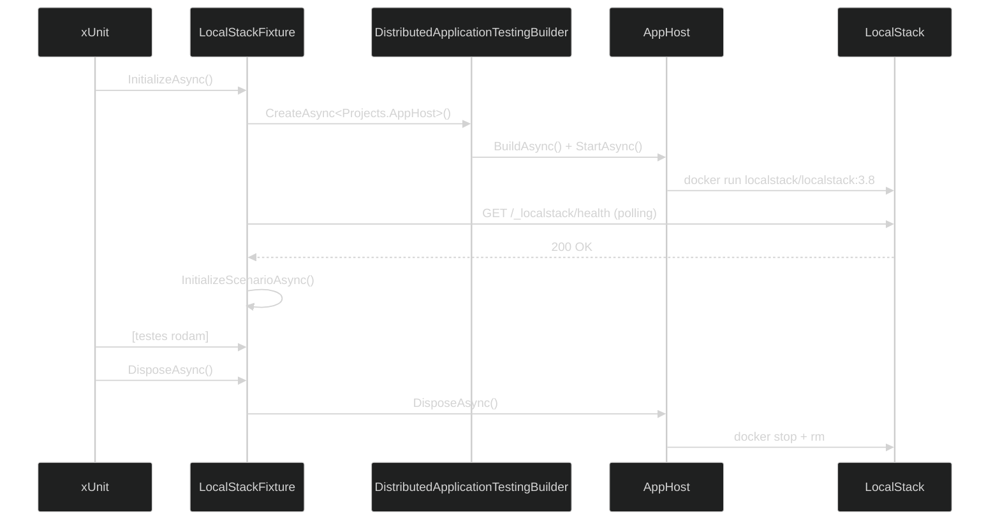

# ADR-002 — Tática de orquestração do ambiente de testes

**Status:** Proposed  
**Data:** 2026-05-24

---

## Contexto

Cada cenário de teste precisa de um container LocalStack rodando antes dos testes e destruído ao final. A solução de orquestração precisa: (1) iniciar e parar containers programaticamente de dentro do xUnit, sem scripts externos; (2) aguardar o container estar saudável antes de prosseguir; (3) funcionar em CI sem intervenção manual.

Evidências no repositório: `src/AppHost/Program.cs` usa `DistributedApplication.CreateBuilder`; `src/Shared/LocalStackFixture.cs` usa `DistributedApplicationTestingBuilder.CreateAsync<Projects.AppHost>()`; `AspireVersion` presente nos `.csproj` de cenários.

---

## Opções avaliadas

### Opção A — docker-compose

- Arquivo `docker-compose.yml` sobe o LocalStack antes dos testes
- **Contra:** ciclo de vida externo ao xUnit — o desenvolvedor precisa executar `docker-compose up` antes de `dotnet test`; CI requer etapa adicional; não dá controle programático de quando o container está pronto

### Opção B — .NET Aspire (escolhida)

- `AppHost/Program.cs` declara o container LocalStack com serviços, portas e variáveis de ambiente
- `LocalStackFixture` usa `DistributedApplicationTestingBuilder` para iniciar o AppHost dentro do xUnit
- **Pró:** ciclo de vida totalmente programático (sobe ao iniciar a fixture, desce ao dispor); healthcheck via polling HTTP integrado; nenhum script externo; funciona em qualquer ambiente com Docker
- **Contra:** adiciona dependência do pacote `Aspire.Hosting.Testing`; AppHost precisa estar no mesmo repositório

### Opção C — Testcontainers for .NET

- Biblioteca `Testcontainers` gerencia o container LocalStack diretamente no C#
- **Pró:** sem dependência de Aspire; API fluente
- **Contra:** perde a integração com o dashboard Aspire (útil em desenvolvimento); configuração de bind mounts e variáveis de ambiente é mais verbosa; menos coerente com o foco didático do catálogo (que demonstra Aspire)

### Opção D — não fazer nada (testes assumem LocalStack já rodando)

- Developer sobe LocalStack manualmente na porta 4566
- **Contra:** onboarding frágil; CI sem automação; cenários não são isolados entre si

---

## Decisão

**Opção B — .NET Aspire como orquestrador de containers para os testes.**

---

## Justificativa

Aspire elimina a separação entre "infraestrutura de CI" e "lógica de teste". O `DistributedApplicationTestingBuilder` permite iniciar o AppHost programaticamente de dentro do xUnit, com ciclo de vida atado ao `IAsyncLifetime` da fixture. O healthcheck de LocalStack é implementado via polling HTTP (ver ADR-005), garantindo que o container esteja pronto antes do primeiro teste.

Como efeito colateral didático, o catálogo demonstra um uso real do Aspire Testing — o próprio projeto serve de exemplo da tecnologia que documenta.

### Diagrama



### Fragmento representativo

`src/Shared/LocalStackFixture.cs` — inicialização via Aspire Testing Builder:

```csharp
// src/Shared/LocalStackFixture.cs (trecho)
var appHost = await DistributedApplicationTestingBuilder
    .CreateAsync<Projects.AppHost>()
    .ConfigureAwait(false);

_app = await appHost.BuildAsync().ConfigureAwait(false);
await _app.StartAsync().ConfigureAwait(false);
await WaitForLocalStackAsync().ConfigureAwait(false);
await InitializeScenarioAsync().ConfigureAwait(false);
```

`src/AppHost/Program.cs` — declaração do container:

```csharp
// src/AppHost/Program.cs (trecho)
builder
    .AddContainer("localstack", "localstack/localstack", "3.8")
    .WithEnvironment("SERVICES", "s3,sqs,sns,dynamodb,lambda,ssm,secretsmanager,events,scheduler,stepfunctions,rds,ecs")
    .WithBindMount("/var/run/docker.sock", "/var/run/docker.sock")
    .WithHttpEndpoint(port: 4566, targetPort: 4566, name: "gateway", isProxied: false);
```

---

## Consequências

- `src/AppHost/` é parte integrante do projeto de testes, não apenas uma aplicação de produção
- Adicionar novos serviços AWS ao LocalStack requer atualizar a variável `SERVICES` em `AppHost/Program.cs`
- O `DistributedApplicationTestingBuilder` exige referência ao assembly `Projects.AppHost` em cada cenário

---

## Histórico

| Versão | Data | Autor | Mudança |
|--------|------|-------|---------|
| 1.0 | 2026-05-24 | Marco Mendes | Versão inicial |
