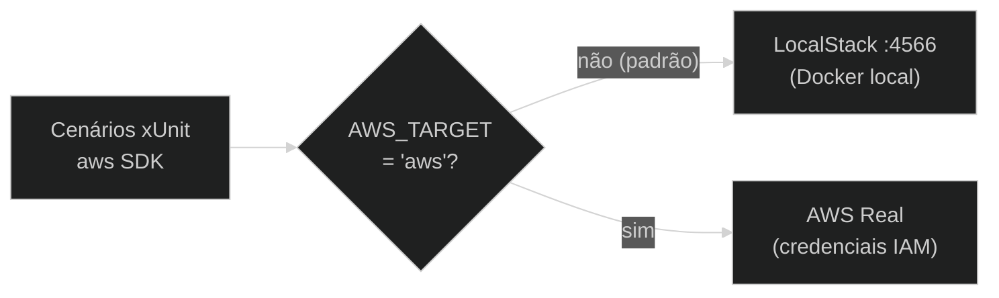

# ADR-003 — Tática de simulação de serviços AWS

**Status:** Proposed  
**Data:** 2026-05-24

---

## Contexto

Os testes precisam interagir com serviços AWS (S3, SQS, SNS, DynamoDB, Lambda, SSM, SecretsManager, EventBridge, Scheduler, StepFunctions). Usar a AWS real em testes automatizados implica custo, credenciais e estado persistente. A alternativa é um simulador local.

Evidências no repositório: `AppHost/Program.cs` usa `localstack/localstack:3.8`; `LocalStackFixture.cs` expõe `Endpoint = "http://localhost:4566"`; variável `AWS_TARGET` controla dual-mode; cenários 07, 08, 11–14 e 16 são skipped em macOS ARM64.

---

## Opções avaliadas

### Opção A — LocalStack Community 3.8 com dual-mode (escolhida)

- Simula todos os serviços necessários (S3, SQS, SNS, DynamoDB, Lambda, SSM, SecretsManager, EventBridge, Scheduler, StepFunctions) em um único container
- Dual-mode: `AWS_TARGET=aws` desvia para a AWS real sem alterar o código dos testes
- **Pró:** zero custo; zero credenciais para a maioria dos cenários; onboarding com `docker` apenas
- **Contra:** Lambda instável em macOS ARM64 (cenários 07–08, 11–14, 16 skipped); StepFunctions requer Pro (cenário 15 skipped); fidelidade imperfeita para edge cases de IAM

### Opção B — LocalStack Pro

- Suporte completo a Lambda em ARM64 e StepFunctions
- **Contra:** custo ~USD 35/mês por desenvolvedor; exige token de licença em CI; onboarding mais complexo

### Opção C — AWS real apenas

- Testes rodam contra conta AWS real
- **Contra:** custo proporcional ao número de execuções; necessário gerenciar credenciais e limpeza de recursos; impossível sem Internet; CI requer secrets com permissões IAM amplas

### Opção D — Mocks in-process (Moq / NSubstitute sobre interfaces AWS SDK)

- Sem Docker; testes rápidos
- **Contra:** não testa a integração real — comportamentos como event source mappings, policies IAM inline e propagação de eventos não são exercitados; objetivo do catálogo é precisamente testar essas integrações

---

## Decisão

**Opção A — LocalStack Community 3.8 com dual-mode via `AWS_TARGET`.**

---

## Justificativa

LocalStack Community cobre todos os 16 cenários do catálogo em Linux/CI sem custo. O dual-mode permite validar cenários contra a AWS real quando necessário (cenário 16 foi testado em conta AWS real). As limitações em ARM64 são documentadas e os cenários afetados são marcados como `Skip` via `EnvironmentLimitations.cs`, impedindo falsos negativos.

### Diagrama



### Fragmento representativo

`src/Shared/LocalStackFixture.cs` — detecção do modo de execução:

```csharp
// src/Shared/LocalStackFixture.cs (trecho)
protected static bool ModoAws =>
    string.Equals(Environment.GetEnvironmentVariable("AWS_TARGET"), "aws",
        StringComparison.OrdinalIgnoreCase);

public async Task InitializeAsync()
{
    if (ModoAws)
    {
        await InitializeScenarioAsync().ConfigureAwait(false);
        return; // não sobe Aspire/LocalStack
    }
    // modo padrão: sobe container LocalStack via Aspire
    _portLock = await AcquirePortLockAsync().ConfigureAwait(false);
    // ...
}
```

`src/Shared/EnvironmentLimitations.cs` — skip condicional para ARM64:

```csharp
// src/Shared/EnvironmentLimitations.cs (trecho)
public static class EnvironmentLimitations
{
    public static bool LambdaSkip =>
        RuntimeInformation.ProcessArchitecture == Architecture.Arm64
        && !ModoAws;
}
```

---

## Consequências

- Cenários Lambda (07, 08, 11–14, 16) são automaticamente skipped em macOS ARM64 no modo LocalStack
- Cenário 15 (StepFunctions) requer LocalStack Pro ou `AWS_TARGET=aws`
- Novos serviços AWS adicionados ao catálogo devem ser incluídos na variável `SERVICES` do `AppHost/Program.cs`
- Execução com `AWS_TARGET=aws` requer credenciais AWS configuradas (`aws configure`) e cleanup manual do EventBridge Scheduler (ver README do cenário 16)

---

## Histórico

| Versão | Data | Autor | Mudança |
|--------|------|-------|---------|
| 1.0 | 2026-05-24 | Marco Mendes | Versão inicial |
