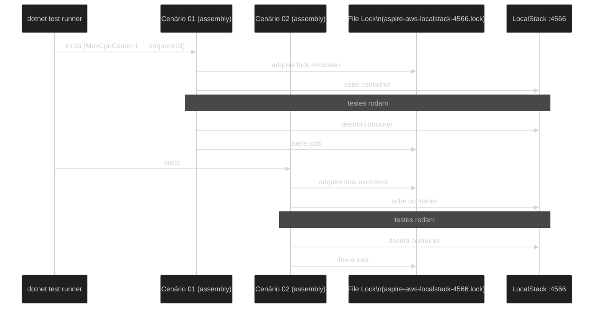

# ADR-004 — Tática de isolamento entre cenários de teste

**Status:** Proposed  
**Data:** 2026-05-24

---

## Contexto

16 projetos xUnit independentes compartilham a mesma porta 4566 para se conectar ao LocalStack. Se dois cenários iniciassem em paralelo, tentariam subir dois containers LocalStack na mesma porta, causando conflito. O mecanismo de isolamento precisa garantir execução sequencial sem exigir configuração manual do desenvolvedor.

Evidências no repositório: `test.runsettings` com `MaxCpuCount=1`; `Directory.Build.targets` injeta `RunSettingsFilePath` em todos os projetos de teste; `LocalStackFixture.cs` usa file lock exclusivo em `Path.GetTempPath()`.

---

## Opções avaliadas

### Opção A — Porta aleatória por cenário

- Cada cenário recebe uma porta disponível dinamicamente
- LocalStack sobe em porta aleatória; `AwsClientFactory` recebe o endpoint como parâmetro
- **Contra:** requer refactoring profundo da factory e das fixtures; LocalStack por porta aleatória multiplica o consumo de recursos Docker; complexidade de configuração do AppHost aumenta significativamente

### Opção B — Porta fixa + execução sequencial (escolhida)

- `MaxCpuCount=1` no `test.runsettings` serializa a execução: um assembly por vez
- File lock adicional em `LocalStackFixture` garante exclusividade mesmo em cenários onde o runner ignore o setting
- **Pró:** simples; sem refactoring; comportamento determinístico; fácil de entender
- **Contra:** suíte completa executa sequencialmente (~3 min); não aproveita múltiplos cores

### Opção C — Rede Docker isolada por cenário

- Cada cenário cria uma rede Docker dedicada; LocalStack sobe em porta 4566 de cada rede
- **Contra:** complexidade alta de infraestrutura; Aspire não expõe abstração de rede Docker no nível de teste; overhead de criar/destruir redes Docker por cenário

### Opção D — não fazer nada (confiar no runner sem configuração)

- **Contra:** corrida por porta 4566; testes falham aleatoriamente em CI com múltiplos workers

---

## Decisão

**Opção B — porta fixa 4566 com execução sequencial via `MaxCpuCount=1` + file lock.**

---

## Justificativa

A decisão privilegia simplicidade sobre velocidade. Com 16 cenários e ~3 minutos de execução total, a execução sequencial é aceitável. O file lock atua como linha de defesa adicional caso o runner seja invocado com flags que sobrescrevam o `MaxCpuCount`. A combinação dos dois mecanismos torna o comportamento determinístico independentemente do ambiente.

A injeção do `RunSettingsFilePath` via `Directory.Build.targets` (não `.props`) é intencional: a propriedade `IsTestProject` só está disponível após a avaliação dos pacotes NuGet, que ocorre depois do `.props`.

### Diagrama



### Fragmento representativo

`src/Shared/LocalStackFixture.cs` — aquisição do file lock:

```csharp
// src/Shared/LocalStackFixture.cs (trecho)
private static async Task<FileStream> AcquirePortLockAsync()
{
    var lockPath = Path.Combine(Path.GetTempPath(), "aspire-aws-localstack-4566.lock");
    FileStream? stream = null;

    await PollingHelper.WaitUntilAsync(async () =>
    {
        try
        {
            stream = new FileStream(lockPath,
                FileMode.OpenOrCreate, FileAccess.ReadWrite, FileShare.None);
            return true;
        }
        catch (IOException) { return false; }
    }, timeout: TimeSpan.FromMinutes(15)).ConfigureAwait(false);

    return stream!;
}
```

`Directory.Build.targets` — injeção do RunSettings em todos os projetos de teste:

```xml
<!-- Directory.Build.targets -->
<ItemGroup Condition="'$(IsTestProject)' == 'true'">
  <None Include="$(MSBuildThisFileDirectory)test.runsettings"
        Link="test.runsettings"
        CopyToOutputDirectory="PreserveNewest" />
</ItemGroup>
```

---

## Consequências

- A suíte completa roda em ~3 minutos em hardware convencional (execução sequencial)
- Nunca executar `dotnet test aspire-aws.sln --parallel` — sobrescreveria o `MaxCpuCount=1`
- O file lock tem timeout de 15 minutos; cenários travados indefinidamente precisarão de intervenção manual para liberar o arquivo de lock em `/tmp/`

---

## Histórico

| Versão | Data | Autor | Mudança |
|--------|------|-------|---------|
| 1.0 | 2026-05-24 | Marco Mendes | Versão inicial |
