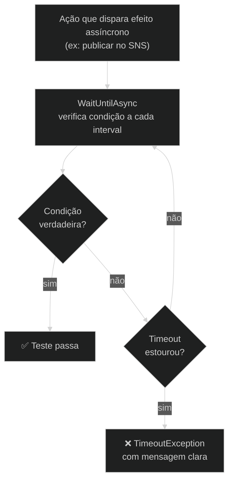

# ADR-005 — Tática de asserções assíncronas

**Status:** Proposed  
**Data:** 2026-05-24

---

## Contexto

Testes de integração AWS envolvem efeitos assíncronos: uma mensagem publicada num tópico SNS precisa de alguns milissegundos para chegar na fila SQS; uma Lambda invocada por event source mapping leva tempo para processar e persistir no DynamoDB. O teste precisa aguardar esse efeito antes de fazer a asserção. A abordagem ingênua é `Task.Delay(fixedMs)` — mas isso torna os testes lentos (se o delay for grande) ou flaky (se for pequeno).

Adicionalmente, alguns cenários precisam verificar que um efeito *nunca* acontece (teste negativo), como no cenário 14 que garante que eventos com `source` errado não disparam a Lambda.

Evidência no repositório: `src/Shared/PollingHelper.cs` implementa `WaitUntilAsync` e `AssertNeverAsync`; nenhum uso de `Task.Delay` em lógica de asserção nos arquivos de teste.

---

## Opções avaliadas

### Opção A — `Task.Delay` com tempo fixo

- `await Task.Delay(3000)` antes de verificar o resultado
- **Contra:** torna testes lentos em máquinas rápidas; testes flaky em máquinas lentas ou CI sobrecarregado; não escalona para cenários com latências variáveis

### Opção B — Polling com timeout configurável (escolhida)

- `WaitUntilAsync(condition, timeout, interval)` repete a verificação até ela ser verdadeira ou o timeout estourar
- `AssertNeverAsync(condition, duration, interval)` verifica que a condição permanece falsa durante toda a janela de tempo
- **Pró:** testes terminam tão rápido quanto o sistema responder; falha com mensagem clara no timeout; timeout e intervalo configuráveis por cenário
- **Contra:** adiciona lógica de infraestrutura de teste; implementação precisa ser correta para não mascarar erros

### Opção C — Biblioteca de testes assíncronos (ex: Polly `WaitAndRetry`)

- Usar Polly para definir políticas de retry nas asserções
- **Contra:** dependência adicional; overhead de configuração de pipeline Polly; semântica de retry é diferente de "aguardar condição"

### Opção D — Event sourcing (aguardar evento do LocalStack)

- Subscrever num endpoint de eventos do LocalStack para receber notificação quando o efeito ocorre
- **Contra:** API de eventos do LocalStack não é estável nem documentada oficialmente; acoplamento forte à implementação interna do LocalStack

---

## Decisão

**Opção B — `PollingHelper` com `WaitUntilAsync` e `AssertNeverAsync`.**

---

## Justificativa

O polling com timeout curto e intervalo configurável é o padrão mais robusto para testes de integração assíncronos. O teste termina no primeiro polling bem-sucedido — sem espera desnecessária. `AssertNeverAsync` permite testes negativos com duração determinística. A implementação em `PollingHelper.cs` é simples (52 linhas), sem dependências externas, e pode ser auditada completamente.

### Diagrama



### Fragmento representativo

`src/Shared/PollingHelper.cs` — implementação completa:

```csharp
// src/Shared/PollingHelper.cs
public static async Task WaitUntilAsync(
    Func<Task<bool>> condition,
    TimeSpan? timeout = null,
    TimeSpan? interval = null,
    string? failureMessage = null)
{
    timeout ??= TimeSpan.FromSeconds(30);
    interval ??= TimeSpan.FromMilliseconds(500);
    var deadline = DateTimeOffset.UtcNow.Add(timeout.Value);

    while (DateTimeOffset.UtcNow < deadline)
    {
        if (await condition().ConfigureAwait(false))
            return;
        await Task.Delay(interval.Value).ConfigureAwait(false);
    }
    throw new TimeoutException(
        failureMessage ?? $"Condition was not met within {timeout.Value.TotalSeconds:F0}s.");
}

public static async Task AssertNeverAsync(
    Func<Task<bool>> condition,
    TimeSpan? duration = null,
    TimeSpan? interval = null,
    string? failureMessage = null)
{
    duration ??= TimeSpan.FromSeconds(5);
    interval ??= TimeSpan.FromMilliseconds(500);
    var deadline = DateTimeOffset.UtcNow.Add(duration.Value);

    while (DateTimeOffset.UtcNow < deadline)
    {
        if (await condition().ConfigureAwait(false))
            throw new XunitException(
                failureMessage ?? "Condition became true when it should have remained false.");
        await Task.Delay(interval.Value).ConfigureAwait(false);
    }
}
```

Uso típico em cenário de teste:

```csharp
// Aguarda Lambda processar e persistir no DynamoDB
await PollingHelper.WaitUntilAsync(async () =>
{
    var item = await fixture.DynamoDB.GetItemAsync(tableName, key);
    return item.Item.ContainsKey("result");
}, timeout: TimeSpan.FromSeconds(30));

// Verifica que evento com source errado nunca dispara a Lambda
await PollingHelper.AssertNeverAsync(async () =>
{
    var items = await fixture.DynamoDB.ScanAsync(new ScanRequest { TableName = tableName });
    return items.Items.Any();
}, duration: TimeSpan.FromSeconds(5));
```

---

## Consequências

- **Proibido** usar `Task.Delay` como mecanismo de asserção nos testes — usar sempre `PollingHelper`
- Timeouts padrão (30s para `WaitUntilAsync`, 5s para `AssertNeverAsync`) podem ser sobrescritos por cenário quando a latência esperada é maior ou menor
- `AssertNeverAsync` adiciona pelo menos `duration` ao tempo de execução do teste — usar o menor valor que seja confiável para o cenário

---

## Histórico

| Versão | Data | Autor | Mudança |
|--------|------|-------|---------|
| 1.0 | 2026-05-24 | Marco Mendes | Versão inicial |
