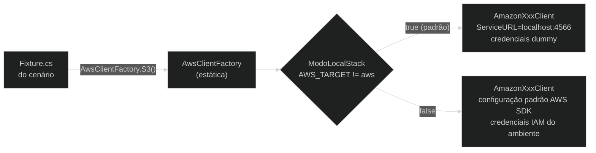

# ADR-006 — Tática de abstração de clientes AWS

**Status:** Proposed  
**Data:** 2026-05-24

---

## Contexto

O AWS SDK for .NET requer configuração específica para conectar ao LocalStack: `ServiceURL = "http://localhost:4566"`, `AuthenticationRegion = "us-east-1"`, credenciais dummy (`test/test`), e `ForcePathStyle = true` para S3. Em modo `AWS_TARGET=aws`, essas configurações não devem ser aplicadas — o SDK deve usar as credenciais e endpoints padrão da AWS.

Sem abstração, cada cenário repetiria essa lógica de configuração, criando risco de inconsistência e dificultando a troca de endpoint (ex: ao testar contra um LocalStack em outra máquina).

Evidência no repositório: `src/Shared/AwsClientFactory.cs` — factory estática com 13 métodos de criação de clientes; todos os `Fixture.cs` dos cenários usam `AwsClientFactory.S3()`, `AwsClientFactory.SQS()`, etc.

---

## Opções avaliadas

### Opção A — Construção direta de clientes em cada fixture

- Cada `Fixture.cs` instancia `new AmazonS3Client(credentials, config)` com as configurações inline
- **Contra:** duplicação em 16 cenários; mudança no endpoint (ex: porta ou host) exige editar todos os fixtures; risco de fixture criar cliente com configuração incorreta para o modo (LocalStack vs AWS real)

### Opção B — Factory estática centralizada (escolhida)

- `AwsClientFactory` expõe um método por serviço (`S3()`, `SQS()`, `DynamoDB()`, etc.)
- Internamente detecta `AWS_TARGET` e aplica a configuração correta para LocalStack ou AWS real
- **Pró:** ponto único de configuração; troca de endpoint afeta apenas `AwsClientFactory.cs`; `Fixture.cs` fica limpo — uma linha por cliente
- **Contra:** método estático dificulta injeção de dependência (irrelevante em contexto de testes)

### Opção C — Interface `IAwsClientFactory` com injeção de dependência

- `IAwsClientFactory` injetada via construtor nos fixtures
- **Contra:** overhead desnecessário para testes; xUnit fixtures não usam DI container por padrão; adiciona complexidade sem benefício prático no contexto de testes isolados

### Opção D — não fazer nada (construção ad-hoc)

- Cada desenvolvedor configura o cliente como preferir
- **Contra:** inconsistência; bugs silenciosos (ex: S3 sem `ForcePathStyle` no LocalStack falharia com erros de DNS obscuros)

---

## Decisão

**Opção B — `AwsClientFactory` estática centralizada com dual-mode.**

---

## Justificativa

A factory resolve o problema de configuração dual (LocalStack vs AWS real) em um único lugar. O método `Configure<TConfig>` genérico aplica `ServiceURL`, `AuthenticationRegion` e `UseHttp` para qualquer tipo de `ClientConfig`, evitando repetição. A propriedade `ModoLocalStack` encapsula a detecção de ambiente. Trocar o endpoint do LocalStack (ex: host remoto para testes em equipe) é uma mudança de uma linha.

### Diagrama



### Fragmento representativo

`src/Shared/AwsClientFactory.cs` — dual-mode e método genérico de configuração:

```csharp
// src/Shared/AwsClientFactory.cs (trecho)
public static class AwsClientFactory
{
    private static BasicAWSCredentials Credentials => new("test", "test");

    private static bool ModoLocalStack =>
        !string.Equals(Environment.GetEnvironmentVariable("AWS_TARGET"), "aws",
            StringComparison.OrdinalIgnoreCase);

    public static AmazonS3Client S3(string endpoint = LocalStackFixture.Endpoint) =>
        ModoLocalStack
            ? new AmazonS3Client(Credentials, Configure(new AmazonS3Config { ForcePathStyle = true }, endpoint))
            : new AmazonS3Client();

    public static AmazonSQSClient SQS(string endpoint = LocalStackFixture.Endpoint) =>
        ModoLocalStack
            ? new AmazonSQSClient(Credentials, Configure(new AmazonSQSConfig(), endpoint))
            : new AmazonSQSClient();

    private static TConfig Configure<TConfig>(TConfig config, string endpoint)
        where TConfig : ClientConfig
    {
        config.ServiceURL = endpoint;
        config.AuthenticationRegion = RegionEndpoint.USEast1.SystemName;
        config.UseHttp = endpoint.StartsWith("http://", StringComparison.OrdinalIgnoreCase);
        return config;
    }
}
```

Uso em `Fixture.cs` de um cenário:

```csharp
// scenarios/01-S3.Basic/Fixture.cs
public class Fixture : LocalStackFixture
{
    public AmazonS3Client S3 { get; private set; } = null!;

    protected override Task InitializeScenarioAsync()
    {
        S3 = AwsClientFactory.S3();
        return Task.CompletedTask;
    }
}
```

---

## Consequências

- **Proibido** instanciar `AmazonXxxClient` diretamente nos testes — sempre usar `AwsClientFactory`
- Novos serviços AWS adicionados ao catálogo devem ter um método correspondente em `AwsClientFactory.cs`
- O parâmetro `endpoint` dos métodos permite apontar para um LocalStack remoto (`AwsClientFactory.S3("http://192.168.1.10:4566")`), facilitando testes em equipe compartilhada

---

## Histórico

| Versão | Data | Autor | Mudança |
|--------|------|-------|---------|
| 1.0 | 2026-05-24 | Marco Mendes | Versão inicial |
